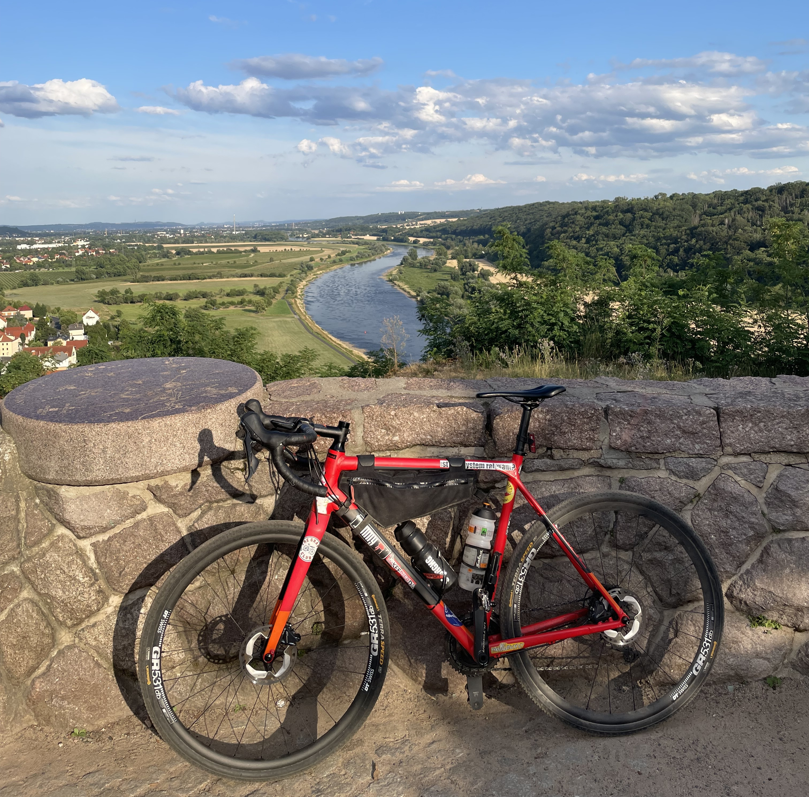

# Meine Fahrräder

## Gravelrad

| Hersteller | Cube |
| --- | --- |
| Modell | Cross Race SL |
| Modelljahr | 2019 |
| Rahmen | Aluminium |
| Übersetzung | 46/34 x 11-36 |
| Umwerfer | Shimano Ultegra FD-R8000-BM |
| Schaltwerk | Shimano Ultegra RD-R8000-DGS, 11-fach |
| Bremsen | Shimano Ultegra BR-R8070 |
| Gewicht | 10 kg |
| Rahmengröße | 58 |
| Kaufdatum | 03.2019 |

[Hersteller-Link](https://archiv.cube.eu/2019/288300)

### Modifikationen
- viele tolle Sticker!
- Laufradsatz von slowbuild
    - Nabe: DT Swiss 350
    - Felgen: DT Swiss GR 531
    - Material: Aluminium
- Sattel: SQlab 612 Ergowave 12 cm
- Kleines Kettenblatt mit 34 Zähnen, statt 36
- Kassette: Sunrace 11-36 statt 11-32
- Bremsscheiben: Shimano Deore XT RT-MT800
- Reifen: Continental Terra Speed, 40-622
- Carbon-Sattelstütze von Canyon

## Rennrad

| Hersteller | Diamant |
| --- | --- |
| Modell | Agree C:62 SL |
| Modelljahr | 2021 |
| Rahmen | Carbon |
| Übersetzung | 50/34 x 11-32 |
| Umwerfer | Shimano Ultegra Di2 FD-R8050-F |
| Schaltwerk | Shimano Ultegra Di2 RD-8050-DGS, 11-fach |
| Bremsen | Shimano Ultegra BR-R8070 |
| Laufradsatz | Fulcrum Racing 77 DB |
| Reifen | Continental Grand Sport Race SL, 28-622 |
| Lenker | Newmen Advanced Wing Bar, Carbon |
| Sattelstütze | Newmen Advanced, Carbon, 27.2mm |
| Sattel | Natural Fit Nuance Lite |
| Gewicht | 8,2 kg |
| Rahmengröße | 56 |
| Kaufdatum | 06.2021 |

[Hersteller-Link](https://archiv.cube.eu/2021/478300)

## Stadtrad

| Hersteller | Specialized |
| --- | --- |
| Modell | Sirrus X 3.0 EQ |
| Modelljahr | 2021 |
| Rahmen | Aluminium |
| Übersetzung | 40 x 11-42 |
| Schaltwerk | Shimano Deore M5100, 11-fach |
| Bremsen | Tektro HD-R280 |
| Reifen | Pathfinder Sport, 700x38mm |
| Gewicht | 12,5 kg |
| Rahmengröße | L |
| Kaufdatum | 01.2023 |

## Ehemalige Fahrräder

### Hercules Stadtrad

| Hersteller | Hercules |
| --- | --- |
| Rahmen | Stahl |
| Übersetzung | Singlespeed |

### Rosi

| Hersteller | Diamant |
| --- | --- |
| Rahmen | Stahl |
| Übersetzung | Singlespeed |

Rosi, benannt nach Rosinante, Ross des Ritters von der traurigen Gestalt, hat mich viele Jahre während meines Studiums
durch Berlin getragen.

### Cube Kathmandu

| Hersteller | Cube |
| --- | --- |
| Modell | Kathmandu |
| Modelljahr | 2017 |
| Rahmen | Aluminium |
| Kaufdatum | 09.2017 |

[Hersteller-Link](https://archiv.cube.eu/2017/842000)

Mein Cube Kathmandu wurde mir in meinem Frankreich-Urlaub 2018 in Grenoble geklaut. Das Fahrrad lag im Kofferraum meines
VW Golf Kombi. Die Diebe haben die Seitenscheibe der hinteren Tür auf der Fahrerseite eingeschlagen und sind so ins Auto
eingebrochen. Im Auto konnten sie die Kofferraumklappe öffnen und das Fahrrad aus dem Kofferraum holen.
