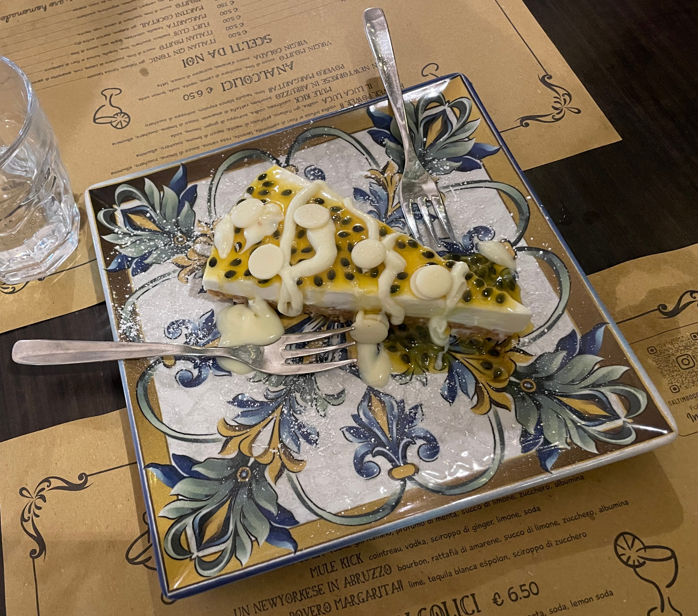

# Logbook

## Italienreise
_2023-11-21_  
Schon lange wollte ich nach Italien und nun habe ich mir diesen kleinen Traum zusammen mit meiner Freundin erfüllt.
Unsere Reise begann am 26.09.2023 mit der ersten Station Venedig.

### Venedig
Venedig ist die Haupstadt der Region Venetien und ein Pilgerort für Touristen aus aller Welt. Die Stadt war gut besucht,
aber ich habe es nicht als störend empfunden. Wahrscheinlich ist zur Hauptreisezeit auch deutlich mehr los, als Anfang
Oktober. Zwei Dinge vorweg: ich habe keinen Gestank wahrgenommen, obwohl viele Leute davon berichten. Außerdem sollte
man keine hochglanzpolierte Stadt erwarten. Die repräsentativen Prunkbauten wie der Dogenpalast sehen prachtvoll aus.
Dem Rest der Stadt ist der Zahn der Zeit anzusehen. Wir haben das nicht als störend, sondern als echt und unverstellt
empfunden. Die historische Altstadt ist genau das - historisch, und darf ruhig auch so aussehen.


Venedig ist keine Stadt im herkömmlichen Sinne und alles andere als gewöhnlich. Das Stadtgebiet umfasst sehr viele
kleinere und größere Inseln. Wir haben lediglich die "Hauptinsel" Venezia und das Strandbad der Venezianer Il Lido
besucht. Auf der Hauptinsel ist das Auto- und Fahrradfahren verboten. Hauptverkehrsmittel ist das Boot. Es gibt sogar
einen öffentlichen Bootsnahverkehr. Diese "Wasserbusse" heißen Vaporetto, bzw. Vaporetti im Plural. Wir haben uns gleich
bei Ankunft am Flughafen ein 3-Tagesticket für den Nahverkehr gekauft und das Ticket sehr gut genutzt, auch weil unser
Hotel im Stadtteil Mestre auf dem Festland lag. Wir sind also jeden Tag mit der Straßenbahn zum "Piazalle Roma" gefahren
und von dort aus mit dem Vaporetto oder zu Fuß weiter.


Sehr empfehlenswert ist eine Fahrt mit der Vaporetto-Linie 1 zwischen Piazalle Roma und Markusplatz (San Marco). Das
kann man einmal bei Tag und einmal bei Nacht machen, Venedig ist zu jeder Tageszeit wunderschön. Am meisten genossen
haben wir die Fahrten im hinteren Außenbereich der Vaporetti. Wir haben außerdem die "Guggenheim Collection", ein Museum
für moderne Kunst besucht und können das Museum sehr empfehlen. Am besten hat mir der Außenbereich direkt am Canale
Grande gefallen. Hier steht eine etwas eigenwillige Bronze eines "erregten" Reiters und man kann sich kurz von der
vielen großen Kunst ausruhen während man ganz mondän die vorbeifahrenden Boote beobachtet.


Während unseres Besuchs hat zufällig die Architekturbiennale (Biennale Architettura) stattgefunden. Die Ausstellung war
riesengroß und auf zwei Veranstaltungsorte auf der Hauptinsel verteilt. Im Giardini della Biennale befand sich der
Hauptpavillon und die feststehenden Pavillons vieler Länder. Der deutsche Pavillon wurde während der NS-Zeit errichtet
und man sieht dem Bau den damals herrschenden Größenwahn deutlich an. Der zweite Veranstalungsort waren die Arsenale
Exhibition Spaces. Hier befanden sich die Pavillons vieler Länder, die vermutlich nicht bei jeder Biennale an der
Ausstellung teilnehmen und einige weitere Hallen ohne fixe Länderzuordnung, sowie die Ausstellung des fiktiven Landes
"[Hy Brasil](https://de.wikipedia.org/wiki/Brasilinsel)". Der Besuch der Architekturbiennale war für mich auf jeden Fall
einer der Höhepunkte unseres Italienurlaubs. Man sollte für den Besuch allerdings besser zwei Tage einplanen. Wir haben
einen vollen Tag dort vollbracht, haben vieles nicht gesehen und waren am Ende des Tages trotzdem ziemlich erledigt und
nicht mehr aufnahmefähig.


Zu guter Letzt kann ich einen Besuch am Badestrand, zum Beispiel auf der Insel Il Lido sehr empfehlen. Venedig ist
nicht nur kulturell ein Höhepunkt, sondern bietet auch herrliche Sandstrände an der wunderschönen Adriaküste und selbst
im Oktober noch bestes Badewetter.

### Bologna
Am Freitag ging es mit dem Zug weiter nach Bologna. Bologna ist die Haupstadt der Region Emilia-Romagna und trägt drei
Beinamen. "La rossa" (die Rote) wegen der vielen roten Dächer, die man beim Blick über die Stadt sieht. "La dotta" (die
Gelehrte) weil Bologna mit der "Università di Bologna - Alma mater studiorum", die älteste Universität Europas
beherbergt. Und drittens "la grassa" (die Dicke), weil viele Spezialitäten die wir mit der italienischen Küche
assoziieren aus Bologna kommen, z.B. die Lasagne, Tortellini, Mortadella oder die Sauce Bolognese. Interessanterweise
bekommt man in Bologna aber keine Spaghetti Bolognese, sondern allerhöchstens Pasta con ragù alla Bolognese oder
meistens Tagliatelle al ragù. Die Sauce Bolognese wird in Bologna niemals mit Spaghetti serviert und Wiener Würstchen
gibt es in Wien schließlich auch nicht.


Anders als die übrigen Städte, die wir auf unserer Italienreise besucht haben, ist Bologna vom Massentourismus verschont
geblieben. Trotzdem ist die Stadt sehr sehenswert und vergleichsweise modern. Vermutlich ist sie gerade deswegen auch
lebenswerter als die anderen Städte und irgendwie authentischer. In Bologna hatte ich tatsächlich den Eindruck Italien
zu erleben und nicht bloß einen Ort zu besuchen, der sich den vielen Touristen angepasst hat.


Warum also lohnt sich ein Besuch in Bologna? Wegen einer sehr schönen Altstadt, mit unheimlich vielen Arkadengängen. Wir
hatten das Gefühl uns durch die gesamte Altstadt durch Arkadengänge bewegen zu können. So bleibt man trocken, wenn es
tatsächlich mal regnet und hat immer Schatten wenn die Sonne scheint. Natürlich befindet sich auch der längste
Arkadengang der Welt in Bologna, der auf den Hügel Colle della Guardia mit der Kirche Santuario della Madonna di San
Luca führt. Von hier aus hat man einen tollen Blick über die Stadt und über die Hügel der Emilia-Romagna.


Neben der vielen Arkadengänge beeindrucken Bolognas Türme. Am Rande des ehemaligen jüdischen Ghettos (Ghetto
ebraico) von Bologna stehen "Le Due Torri", die zwei Türme "Garisenda e degli Asinelli". Die Türme wurden im
tiefsten Mittelalter (um 1100) im Wettstreit zweier reicher Familien errichtet. Als sich der Torre della Garisenda
bedenklich zu neigen begann, musste der Bau gestoppt werden. Später wurde der Turm sogar noch in der Höhe gestutzt.
Angeblich ist der Turm noch schiefer als der schiefe Turm von Pisa.


### Florenz
Nachdem wir uns drei Tage mit Bologneser Köstlichkeiten vollgestopft haben ging es mit dem Schnellzug der Trenitalia
weiter in die Hauptstadt der Toskana, Florenz. Die Innenstadt der Renaissance-Metropole wird von der beeindruckenden
Kathedrale Santa Maria del Fiore dominiert. Die gewaltige Kuppel und der Turm sind von weither sichtbar. Geht man näher
heran erblickt man eine wunderschön verzierte weiße Marmorfassade.


Ein weiterer Höhepunkt der Altstadt ist der Palazzo Vecchio am Piazza della Signoria. Hier gibt es, neben dem imposanten
Innenhof des Palastes, den Neptunbrunnen und eine Kopie der berühmten David-Statue von Michelangelo zu sehen. Um das 5m
hohe Original der Statue zu sehen, muss man allerdings in die Akademie (bzw. Galleria dell'Accademia). Diese brillante
Idee haben auch viele andere, es lohnt sich trotzdem Michelangelos Meisterwerk aus der Nähe zu sehen. Die Statue
erscheint u.a.  deshalb so imposant, weil Hände, Füße und Kopf etwas zu groß geraten sind. Hier hat sich Michelangelo
eines Tricks bedient, der dem ungeschulten Auge nicht unangenehm auffällt, dafür aber eine überwältigende Wirkung
entfaltet.


Natürlich ist kein Florenz-Besuch komplett ohne die Uffizien. Das Gebäude diente ursprünglich als ein
Verwaltungsgebäude, daher die Wortverwandtschaft mit "Offices". In den Uffizien versammeln sich einige der bedeutendsten
Werke der Renaissance. Mir am meisten in Erinnerung geblieben sind die Werke "Das Opfer von Isaak" und die auf einen
runden Schild gemalte Medusa, beide von Caravaggio, sowie die riesige Galerie von Künstler-Selbstporträts. Hier finden
sich auch einige Selbstporträts moderner Künstler, die die riesige Sammlung realistisch dargesteller Mythen- und
Bibelszenen angenehm auflockern.


Kulinarisch gesehen sollte man in Florenz einmal ein Schiacciata-Sandwich probieren. Diese werden an fast jeder Ecke
angeboten. Außerdem kann ich ein Mittagessen im quirligen Ambiente des Mercato di Sant’Ambrogio sehr empfehlen. Hier
kann man mit Einheimischen ein verhältnismäßig günstiges und leckeres Mittagessen zu sich nehmen. Eine weitere
Spezialität der florentinischen Küche ist angeblich das Lampredotto (Kutteln), aber das war mir dann doch zu speziell.

### Rom
Alle Wege führen nach Rom, und so auch die Bahnlinien, daher war Rom die letzte Station unserer Italienreise. Angenehm
überrascht war ich von der Taktung der Schnellzüge zwischen Florenz und Rom. Hier fährt ca. alle 15-20 Minuten ein
Schnellzug zwischen den beiden Touristenmetropolen, betrieben von den Bahngesellschaften Trenitalia und Italo. Überhaupt
empfand ich die Reise mit italienischen Zügen als sehr angenehm, da die Züge stets pünktlich, sauber und angenehm
klimatisiert waren. Natürlich ist meine Erfahrung nicht repräsentativ, aber von der Deutschen Bahn bin ich leider
anderes gewohnt.


Nun also Rom, die ewige Stadt, der Nabel der Welt. Ich kann zu Rom nicht mehr sagen, als viele andere schon besser
gesagt haben, außer dass die Stadt unbedingt einen Besuch wert ist. Das Kolosseum, das Forum Romanum, den Vatikan mit
dem Petersdom und die vielen anderen Sehenswürdigkeiten mit eigenen Augen zu sehen lohnt sich in jedem Fall. Allerdings
denken sich das auch viele andere Menschen, daher ist die Stadt rappelvoll mit Touristen. Will man nahe genug an den
Trevibrunnen herankommen, um ein paar Cent hineinzuwerfen, bedarf es schon eines gewissen Durchsetzungsvermögens. Die
Villa Borghese konnten wir nicht besuchen, weil mit wenigen Tagen Vorlauf keine Tickets zu bekommen sind. Und will man
den Petersdom besuchen, muss man sich darauf einstellen eine ganze Weile in einer sehr langen Schlange auf dem
Petersplatz zu verbringen, nur um dann noch das aus dem Flughagen bekannte Sicherheitstheater über sich ergehen zu
lassen.


So beeindruckend die Stadt auch ist, so unübersehbar sind ihre Probleme. Viele bedauernswerte Menschen versuchen sich an
den Touristenmagneten ein paar Euro mit gekühlten Getränken zu verdienen (obwohl es fast überall kostenloses Trinkwasser
aus öffentlichen Brunnen gibt). In Rom fahren offenbar die langsamsten Straßenbahnen der Welt und die Fahrpläne werden
anscheinend eher als grobe Richtlinie angesehen. Der römische Straßenverkehr löste bei mir nur blankes Entsetzen aus.
Hier möchte ich nicht Auto fahren und schlimmer noch, wer in Rom Fahrrad fährt muss mit seinem Leben abgeschlossen
haben. Rom ist so vollgestopft mit beeindruckenden antiken Bauwerken, dass es einem fast schon Leid tun kann, wenn sie
gegenüber den vielen Sehenswürdigkeiten der ersten Kategorie nur verblassen können. Anderen Städten würde z.B. eine
Porta Maggiore zum UNESCO-Welterbetitel verhelfen und unbändiges Staunen auslösen. In Rom kräht danach kein Hahn, und
der Busplatz umher wirkt entsprechend vernachlässigt.


Nach fünf Tagen Rom mussten wir am 10.10. mit einem weinenden Auge den Rückflug antreten. Während zwei Wochen Italien
hatten wir nicht ein einziges Mal schlechtes Wetter und so graute es uns ein wenig vor dem grauen Berlin. Zum Abschied
überraschte mich der moderne Flughafen Fiumicino noch einmal sehr positiv. Die Anreise gelang bequem und problemlos mit
dem Zug vom Bahnhof Roma Termini. Und die Sicherheitskontrollen gingen schnell und ganz ohne Theater. Dank neuer Scanner
mussten wir nicht einmal unsere Trinkflaschen vor der Kontrolle leeren. Auf der Hinreise haben wir am BER leider ganz
anderes erleben müssen.


### Essen
Kurzum: es ist nicht schwierig in Italien gutes Essen zu bekommen. In vielen Fällen war das Essen sehr gut, manchmal
sogar sensationell. Natürlich ist Italien berühmt für Pizza und Pasta und bei den vielen Variationen dieser Gerichte
wird es nicht so schnell langweilig. So kann man bei der Pizza zum Beispiel zwischen der neapolitanischen und der
römischen Pizza unterscheiden. Die neapolitanische Pizza ist etwas dicker, besonders am Rand, während die römische Pizza
idealerweise hauchdünn ist. Bei der Pasta gibt es unzählige Varianten von Nudeln, die mit unterschiedlichen Soßen
serviert werden. So gibt es die Carbonara fast immer mit Spaghetti, die in Deutschland verbreitete "Spaghetti Bolognese"
wird man in Italien jedoch nie auf der Karte finden (s.o.).

Auch bei den Süßspeisen (Dolci) kommt man in Italien voll auf seine Kosten. Ob Tiramisu, Panna Cotta oder eine der
vielen Kuchenvariationen, fast alles schmeckt hervorragend. Ja, und dann gibt es noch Gelato. Wir haben nicht ein
einziges Mal während unserer zwei Wochen in Italien schlechtes Eis gegessen, und das obwohl wir nur an zwei Tagen kein
Eis gegessen haben. An fast jedem anderen Tag haben wir sogar zwei Mal am Tag unserer Eisdiät gefrönt.



Eisdielen in Italien heißen entweder Gelateria oder Cremeria. Auffällig war, dass das Eis in der Cremeria subjektiv
immer besonders gut geschmeckt hat. Allerdings weiß ich nicht was der Unterschied zwischen diesen beiden Bezeichnungen
ist. Anders als in Deutschland bestellt man in den meisten Orten keine Kugeln, sondern wählt eine Waffel und kann sich
diese mit beliebigen Geschmacksrichtugen (Gusti) beladen lassen. Bei einer kleineren Waffel (oder Becher) gibt es
dementsprechend etwas weniger Eis und teilweise darf man sich nicht so viele Gusti auswählen, wie bei einer größeren und
teureren Waffel. Italiener verwenden keinen Eislöffel, sondern eine Art Spachtel, mit dem sie teilweise das Eis noch
einmal "bearbeiten", bevor es in der Waffel landet. Das Auftürmen der Gusti in der Waffel kann wohl mit Fug und Recht
als eigene Kunstform betrachtet werden und erfordert einige Erfahrung mit der Statik der jeweiligen Eissorte.

### Fazit
Dieser Italienurlaub war eine meiner schönsten Reisen überhaupt. Das Wetter war fantastisch, ebenso das Essen und die
Italiener. Entgegen vieler Gerüchte waren die Menschen freundlich, hilfsbereit und sprachen fast ausnahmslos gut
Englisch, sodass die Kommunikation niemals zum Problem wurde, obwohl wir beide kein Italienisch sprechen. Nicht zuletzt
ist Italien eine Art riesiges Freilichtmuseum, in dem die Zeit teilweise stehen geblieben zu sein scheint. Hier gibt es
soviel zu sehen und wenn man mal genug hat von der ganzen Kultur, gibt es immer noch eine wunderschöne Natur mit
großartigen Landschaften zu entdecken. Aber die haben wir uns für unseren nächsten Italienurlaub aufgehoben.


---

## (Kein) Geiler Scheiß
_2023-09-18_  
Mein zum Scheitern verurteilter Versuch die Welt in Gut und Schlecht einzuteilen:

| Geiler Scheiß         | Kein Geiler Scheiß    |
|-----------------------|-----------------------|
| Freie Software        | Proprietäre Software  |
| Copyleft              | Copyright             |
| Genossenschaften      | Konzerne              |
| Solidarität           | Individualismus       |
| Wissenschaft          | Esoterik              |
| Informationsfreiheit  | Geheimdienste         |
| Gesellschaft          | Staat                 |
| Privatsphäre          | Benutzertracking      |
| Wahlfreiheit          | Werbung               |
| Chaos Computer Club   | Bitkom                |
| Linux                 | Windows               |
| \*BSD                 | macOS                 |
| bash/zsh/fish         | PowerShell            |
| Firefox               | Chrome/Edge/Safari    |
| Fediverse             | Metaverse             |
| DuckDuckGo            | Google                |
| RISC-V                | Intel/ARM             |
| vim                   | Notepad               |
| IPv6                  | AppleTalk             |
| WireGuard             | IPsec                 |
| Mullvad VPN           | Ranz VPN              |
| Tor                   | Key Escrow            |
| foo over UDP          | TCP over TCP          |
| i3                    | Fenster schubsen      |
| Tastatur              | Maus                  |
| Impfung               | Antivirus             |
| mutt                  | Outlook               |

---

## Goodbye NetworkManager. Hello decent network configuration
_2022-01-29_  
I was recently experiencing problems with the wireless interface on my Debian 11 home server. The connection was very
instable and I could observe `rtlwifi: AP off, try to reconnect now` entries in the kernel log. My first thought was a
power management issue with my wireless adapter, so I put
```
options rtl8188ee swenc=1 ips=0 swlps=0 fwlps=0 aspm=0
```

into `/etc/modprobe.d/rtl8188ee.conf`. However, this did not solve the problem.

### iwd
Somewhere I read that it might be NetworkManager's fault, so I decided to give [iwd](https://iwd.wiki.kernel.org/) (iNet
Wireless Daemon) a try. The setup couldn't be easier, and as always, [the Arch Wiki has a very good
documentation](https://wiki.archlinux.org/title/Iwd). First disable NetworkManager and enable iwd:
```
# systemctl disable --now NetworkManager.service
# systemctl enable --now iwd.service
```

Then, just connect to your wireless network using `iwctl station $IWDEV connect $YOURSSID`. The credentials are stored
in `/var/lib/iwd/$SSID.psk` and the connection will be established automatically the next time you boot. That's it for
the wireless connection. However iwd is not particulary good at configuring your network interfaces with irrelevant
details like an IP address. For example, IPv6 is disabled by default (wtf, it's 2022 guys). Even after I manually
enabled IPv6, I couldn't really get it to work as expected. So I decided to use systemd-networkd for this.

### systemd-networkd
As I already disabled NetworkManager, it couldn't interfere with systemd-networkd. However, your mileage may vary. Make
sure there is no `/etc/network/interfaces*`, netplan or anything else also trying to configure your network interface.
The configuration goes to `/etc/systemd/network/wireless.network` in my case, and is quite straight forward:
```
[Match]
# Name=wlan0
Type=wlan

[Network]
DHCP=ipv4
IgnoreCarrierLoss=true
IPv6AcceptRA=true

[IPv6AcceptRA]
UseDNS=false

[DHCPv4]
UseDNS=false
```

As I only have one wireless interface, I decided to use `Type=wlan`, but it's also perfectly fine to specify the
wireless interface. Again have a look at the great [Arch Wiki documentation on
systemd-networkd](https://wiki.archlinux.org/title/Systemd-networkd) or `man systemd.network` for details.
Then enable systemd-networkd by `systemctl enable --now systemd-networkd.service`. As I wanted to play with DNS over
TLS, I decided to put `UseDNS=false` in there and use systemd-resolved for DNS.

### systemd-resolved
I just found out that the VPN provider [Mullvad offers free ad-blocking DoT-ready DNS
servers](https://mullvad.net/en/help/dns-over-https-and-dns-over-tls/). [The german Wikipedia also has a list of
DoT-ready DNS servers for you.](https://de.wikipedia.org/wiki/DNS_over_TLS#%C3%96ffentliche_DNS-Server) The DNS
configuration goes to `/etc/systemd/resolved.conf` and effectively just looks like this in my case:
```
[Resolve]
DNS=2a07:e340::3#adblock.doh.mullvad.net 194.242.2.3#adblock.doh.mullvad.net 193.19.108.3#adblock.doh.mullvad.net
DNSOverTLS=yes
FallbackDNS=2a00:f826:8:1::254 2a01:4f8:1c0c:82c0::1 94.247.43.254 88.198.92.222 
```

If DoT on the Mullvad servers does not work for whatever reason, I fallback to using DNS servers of the [OpenNIC
project](https://servers.opennic.org/). systemd-resolved has some fallback servers from Cloudflare, Google and Quad9
builtin, but I don't want to use them, even in case.

After enabling systemd-resolved (run `systemctl enable --now systemd-resolved.service`) you can already resolve your
first domain names securely and ad-free. For example try `resolvectl query analytics.google.com`. Oh no, Google
Analytics resolves to 0.0.0.0, that's sad, isn't it? However, you will notice that other DNS resolvers on your system
don't respect your wishes for an ad-free world and happily resolve domain names using whatever nameserver is configured
in your legacy `/etc/resolv.conf`. systemd-resolved provides a stub dns resolver listening on localhost:53 for this and
you can configure it system-wide by symlinking to a pseudo resolv.conf like this:
```
# rm /etc/resolv.conf
# ln -s /run/systemd/resolve/stub-resolv.conf /etc/resolv.conf
```

### Conclusion
I am happy to say, that I finally have a stable wireless connection on my home server, thanks to iwd and
systemd-networkd. As a plus, I am now enjoying an ad-free and privacy-friendly DNS experience. Nice :)

---

## re-encrypt .password-store using new gpg key
_2022-01-02_  
I wanted to import my current password store into a new machine, and re-encrypt all passwords with a new gpg key. A
similar question was asked
[here](https://superuser.com/questions/1238892/how-to-re-encrypt-password-store-using-new-gpg-key). This is how I solved
it:
* on your new machine, create a new gpg key
  * `gpg --generate-key`
* to decrypt the current pass db, you need the old gpg key
* go to your old machine and run
  * `gpg --export KEY_ID > gpg_public.key`
  * `gpg --export-secret-keys KEY_ID > gpg_private.key`
* copy both files to your new machine and import them
  * `gpg --import gpg_public.key`
  * `gpg --import gpg_private.key`
* copy the remote password store to your new machine, f.e. by
  * `git clone $REMOTE:.password-store`
* you might want to get rid of your old git history
  * `rm -rf .password-store/.git`
* now you can re-encrypt all passwords with your new gpg key
  * `pass init NEW_KEY_ID`
  * you have to type the password of your old gpg key to decrypt all passwords in the database
* I also like to make the password store a git repo
  * `pass git init`

That's it.
